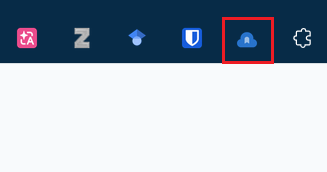

import { Steps } from '@astrojs/starlight/components';

## Installation

Install from the links below or search for "CloudLeaf" in your browser's extension store. No additional configuration required.

| Browser | Install |
| -------- | ---------- |
| Chrome | [Chrome Web Store](https://chrome.google.com/webstore/detail/knpkebnhpcbklnknkcpgkiochlimhcoi) |
| Edge | [Chrome Web Store](https://chrome.google.com/webstore/detail/knpkebnhpcbklnknkcpgkiochlimhcoi) |
| Firefox | [Firefox Add-ons](https://addons.mozilla.org/zh-CN/firefox/addon/cloudleaf/) |

For development builds or manual installation, see [Development Guide](/reference/development).

## First Use

After installation, click the CloudLeaf icon in your browser toolbar to open the popup panel.

You'll need to configure a **sync source** first, then upload your bookmarks.

<Steps>

1. Configure a sync source

   CloudLeaf supports GitHub Gist and WebDAV. Using Gist as an example, you'll need:

   * A GitHub account
   * A Personal Access Token (with `gist` scope)
   * A private Gist as your storage location

   See [Sync Sources](/guides/sync-sources) for detailed steps.

2. First upload

   Return to the popup and click `Upload Bookmarks` to complete your first sync.

3. Restore on other devices

   Install CloudLeaf on another browser, configure the **same sync source**, and click `Download Bookmarks` to restore.

</Steps>

---

For more operations (export, import, preview, multiple sync sources, etc.), see [Usage](/guides/usage).
