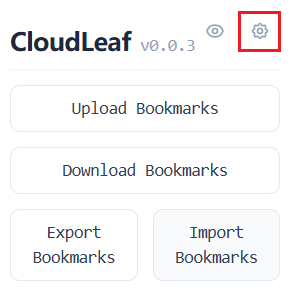
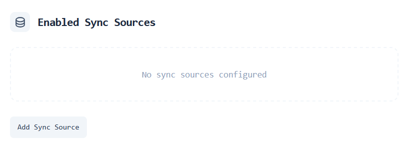
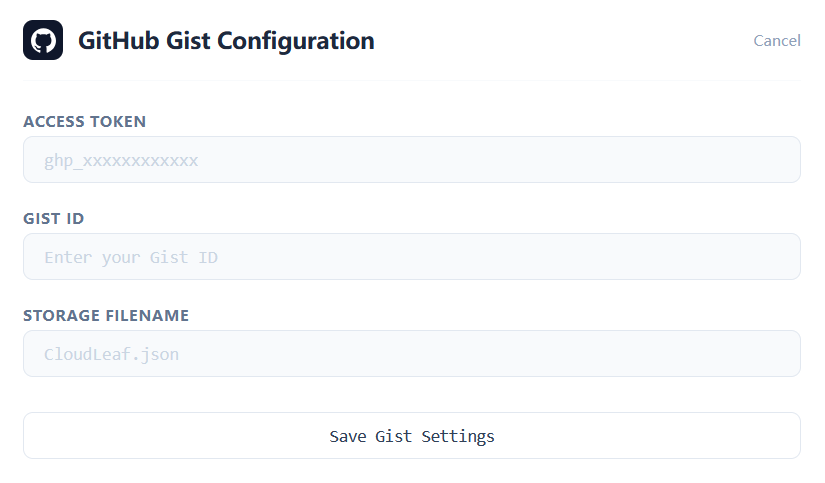
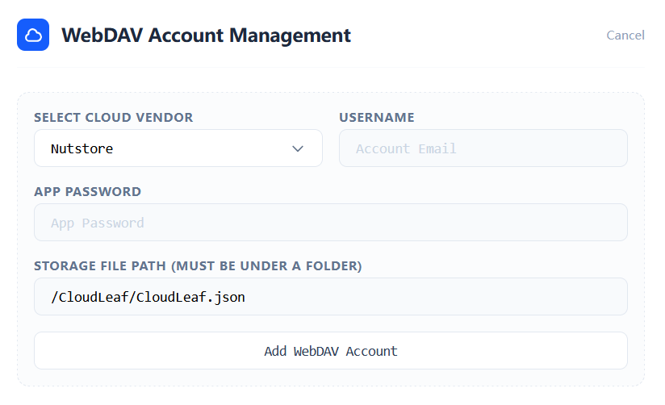
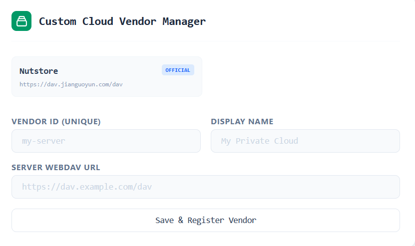
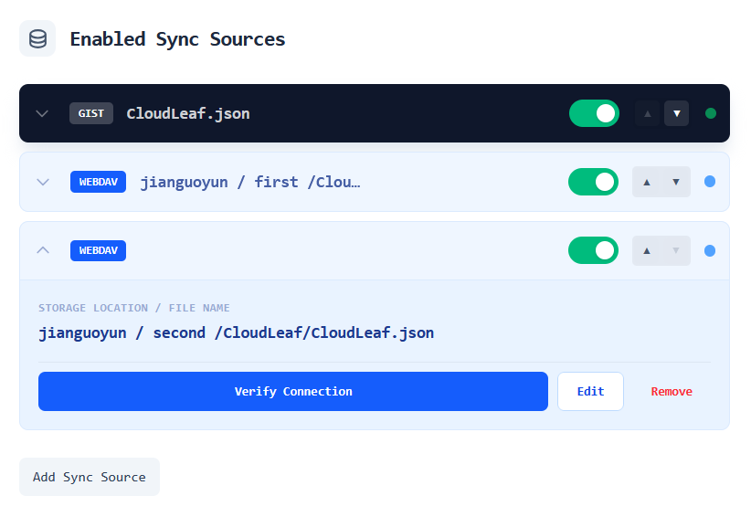

CloudLeaf supports two cloud storage options: [GitHub Gist](#github-gist) and [WebDAV](#webdav).

Click the gear icon in the top-right corner to open the settings page.

Click `Add Sync Source` and choose your storage method.

## GitHub Gist

Store bookmarks in a private GitHub Gist.

### Get a Token

1. Sign in to GitHub and go to [Personal Access Tokens](https://github.com/settings/tokens)
2. Click `Generate new token (classic)`
3. Select the `gist` scope only
4. Copy and save your token immediately — you won't be able to see it again

### Get a Gist ID

1. Go to [GitHub Gist](https://gist.github.com/)
2. Create a new Gist (recommend `Create secret gist`, enter any content as placeholder)
3. After creation, the string at the end of the browser URL is your Gist ID:
   `https://gist.github.com/your-username/a1b2c3d4e5f6...`

### Fill Gist into Extension

1. Select the `Gist` sync source — the `GitHub Gist Config` section will appear below
2. Enter your `Token` and `Gist ID` in the corresponding fields
3. Enter a storage filename (optional, defaults to `CloudLeaf.json`)
4. Click `Save Gist Settings`

## WebDAV

Works with any WebDAV-compatible cloud storage (e.g., Nutstore).

The default configuration uses Nutstore as an example.

### Get App Password

1. Open the Nutstore mobile app → hamburger menu → Settings → **Third-party App Management**
2. Add an app password → enter a name to generate your **app password** (not your login password)

### Fill WebDAV into Extension

1. Select the `WebDAV` sync source — the `WebDAV Account Management` section will appear below
2. Choose `Nutstore` as the cloud vendor
3. Enter your `username` (registered email) and `app password`
4. Enter a storage path (optional, defaults to `/CloudLeaf/CloudLeaf.json`)
5. Click `Add WebDAV Account`

:::caution
The WebDAV storage path must be inside a folder — it cannot be placed directly in the root directory, otherwise it will not work.
:::

### Custom WebDAV

If you use a different WebDAV vendor:

1. Scroll to the bottom of the settings page to the `Custom Cloud Vendor Manager` section
2. Fill in a `Vendor ID (unique)` and `Display Name` for internal and external identification — use a short English ID and a readable name
3. Enter the `Server WebDAV URL` provided by your service
4. Click `Save & Register Vendor`
5. Follow the steps in [Fill WebDAV into Extension](#fill-webdav-into-extension), select your newly registered vendor, and enter your `username` and `app password`

## Manage Sync Sources

CloudLeaf supports multiple sync sources at once. Manage them in the `Enabled Sync Sources` list.

* **Enable / Disable**

  Each sync source has a toggle switch on the right. You can temporarily disable a source without deleting its configuration.

* **Adjust Priority**

  Use the up/down arrow buttons — higher position means higher priority.

* **Dropdown Menu**

  Click the arrow on the left of each entry to expand the dropdown menu for connection testing, editing, or deleting.

* **Test Connection**

  Click `Verify Connection` to check whether the token, app password, and network connectivity are working. Recommended after initial setup.

:::note
About priority:

* When downloading, CloudLeaf pulls bookmark data from the highest-priority sync source
* When uploading, CloudLeaf pushes bookmark data to all enabled sync sources

:::
