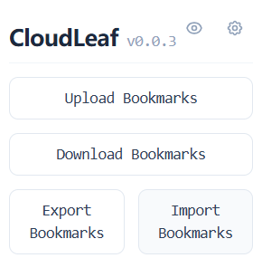
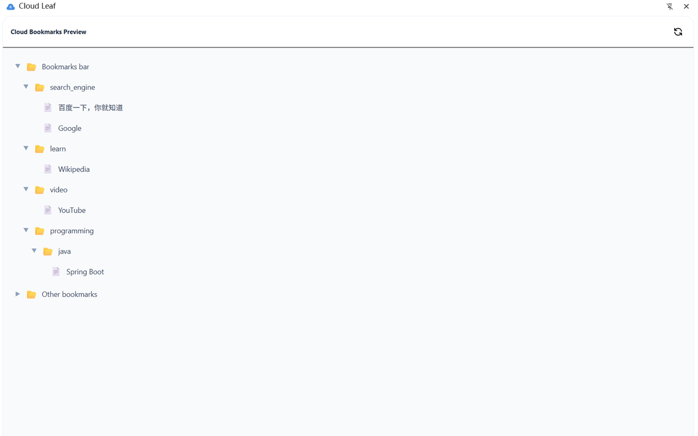

## Actions

After opening the CloudLeaf popup, you'll see four main action buttons: [`Upload Bookmarks`](#upload-bookmarks), [`Download Bookmarks`](#download-bookmarks), [`Export Bookmarks`](#export-bookmarks), and [`Import Bookmarks`](#import-bookmarks).

### Upload Bookmarks

Sync bookmarks from the current browser to the cloud.

1. Click `Upload Bookmarks`
2. CloudLeaf reads your local bookmarks and compares them with the cloud
3. If there are no conflicts, the upload completes automatically
4. If the **cloud is newer than local**, a confirmation dialog will ask whether to force overwrite

:::caution
Uploading will **overwrite** the cloud bookmarks.
:::

### Download Bookmarks

Restore bookmarks from the cloud to the current browser.

1. Click `Download Bookmarks`
2. CloudLeaf fetches bookmark data from your configured sync source
3. If **local is newer than cloud**, a confirmation dialog will ask whether to force overwrite
4. After download, the current browser's bookmarks will be replaced with the cloud content

:::caution
Downloading will **replace** all bookmarks in the current browser. You can check the content in [Preview Mode](#preview-mode) first.
:::

### Export Bookmarks

Save current bookmarks as a local JSON file (Chrome and Edge only).

1. Click `Export Bookmarks`
2. The file is saved to the browser's default download location as `CloudLeaf.json`

### Import Bookmarks

Restore bookmarks from a local JSON file (Chrome and Edge only).

1. Click `Import Bookmarks`
2. Select a previously exported JSON file
3. If local data is newer than the file, a confirmation dialog will appear

## Preview Mode

View your cloud bookmarks at any time without performing an upload or download.

1. Click the eye icon in the top-right corner
2. The side panel expands, displaying the folder tree of your cloud bookmarks
3. Browse the folder structure to see what bookmarks are stored in the cloud

:::tip
Preview mode is not only for checking content before syncing — you can also open the side panel anytime to use your cloud bookmarks directly.
:::

## Conflict Detection

CloudLeaf compares the **local bookmark timestamp** with the **cloud file timestamp** to determine which is newer:

- **Local is newer**: when downloading if local is newer → prompts whether to force download
- **Cloud is newer**: when uploading if cloud is newer → prompts whether to force overwrite
- **In sync**: otherwise, both sides match, proceed directly
