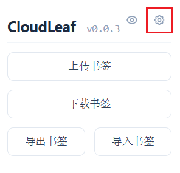
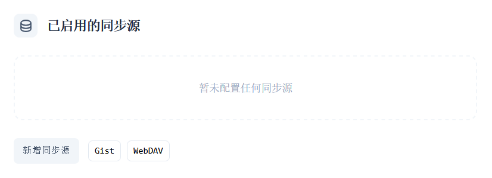
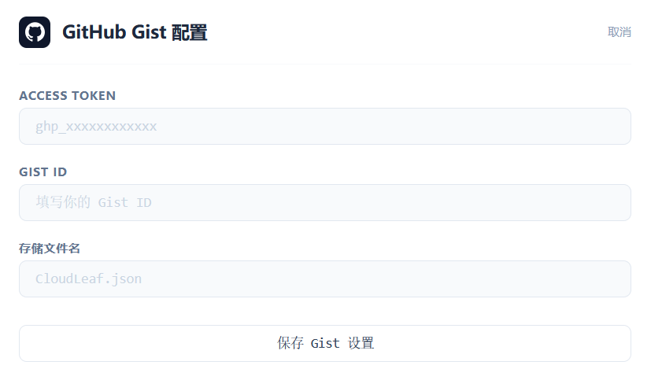
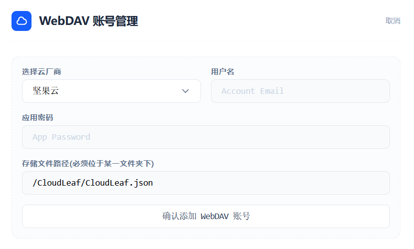
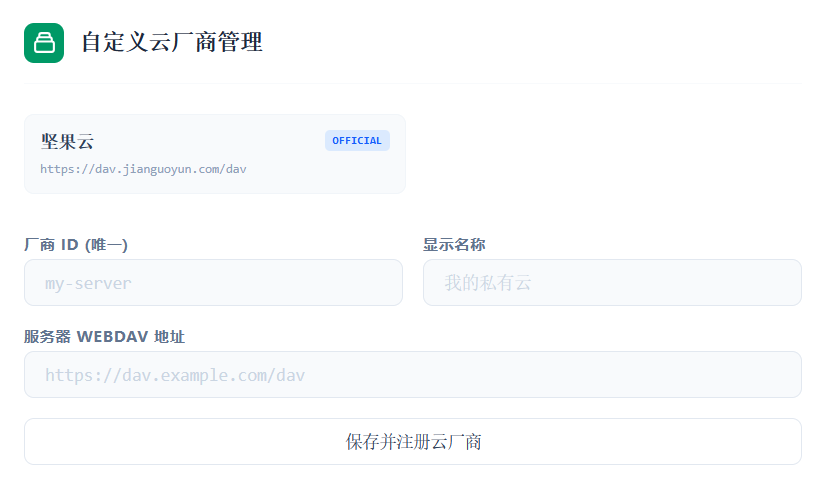
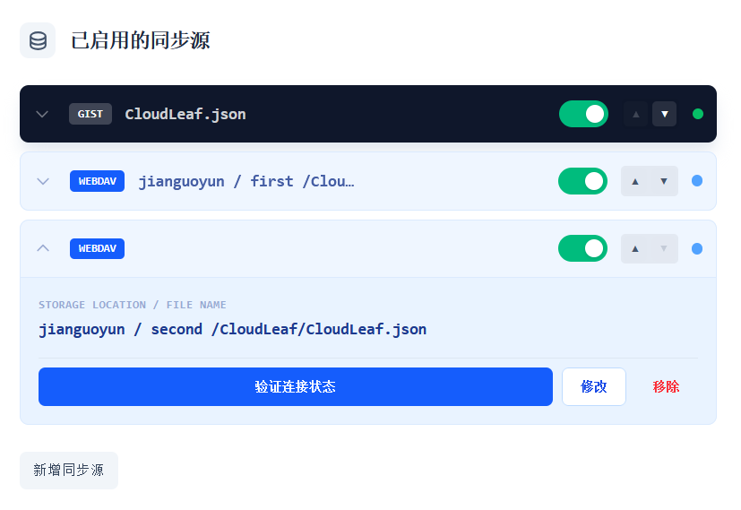

CloudLeaf 支持两种云端存储方式，[GitHub Gist](#github-gist) 和 [WebDAV](#webdav)。

通过点击右上角齿轮，即可进入配置界面。

点击`新增同步源`，选择对应的存储方式。

## GitHub Gist

将书签存入 GitHub 的私有 Gist。

### 获取 Token

1. 登录 GitHub，打开 [Personal Access Tokens](https://github.com/settings/tokens)
2. 点击 `Generate new token (classic)`
3. 勾选 `gist` 权限即可
4. 生成后立即复制保存，离开页面后无法再次查看

### 获取 Gist ID

1. 进入 [GitHub Gist](https://gist.github.com/)
2. 新建一个 Gist（推荐 `Create secret gist`，内容随意输入作为占位即可）
3. 创建后浏览器 URL 末尾的那串字符即为 Gist ID：
   `https://gist.github.com/your-username/a1b2c3d4e5f6...`

### Gist 填入扩展

1. 点击 `Gist` 同步源，下面会出现 `Github Gist 配置`的区域
2. 在对应位置填入 `ACCESS Token` 和 `Gist ID`
3. 输入存储文件名（可选，默认为 `CloudLeaf.json`）
4. 点击`保存 Gist 设置`

## WebDAV

适用于任何支持 WebDAV 的云存储（坚果云等）。

默认配置均以坚果云为例。

### 获取应用密码

1. 打开坚果云手机 App → 三横线菜单 → 设置 → **第三方应用管理**
2. 添加应用密码 → 输入名称后获取**应用密码**（注意不是登录密码）

### WebDAV 填入扩展

1. 点击 `WebDAV` 同步源，下面会出现 `WebDAV 账号管理`的区域
2. 云厂商选择`坚果云`
3. 在对应位置填入`用户名`（即注册邮箱）和`应用密码`
4. 输入存储文件名（可选，默认为 `/CloudLeaf/CloudLeaf.json`）
5. 点击`确认添加 WebDAV 账号`

:::caution
WebDAV 的存储路径必须位于某一文件夹下，不能直接放在根目录，否则无法使用。
:::

### 自定义 WebDAV

如果你使用的是其他 WebDAV 服务商：

1. 将设置界面滑动到最下面到`自定义云厂商管理`区域
2. 分别填入`厂商 ID (唯一)`和`显示名称`，分别用于内部标识和外部展示，建议使用简短的英文 ID 和易懂的名称
3. 填入服务商提供的`服务器 WebDAV 地址`
4. 点击`保存并注册云厂商`
5. 其余部分则和 [WebDAV 填入扩展](#webdav-填入扩展) 一样，选择刚才注册的云厂商，输入`用户名`和`应用密码`即可

## 管理同步源

CloudLeaf 支持同时配置多个同步源，可以在`已启用的同步源`列表中进行管理。

* **启用/禁用**

  在同步源列表中，每个条目右侧有开关，可以临时停用某个源而不删除配置。

* **调整优先级**

  使用上下箭头按钮，位置越高优先级越高。

* **下拉菜单**

  点击条目左侧的箭头，可以打开下拉菜单，进行验证连接状态、修改、删除等操作。

* **测试连接**

  点击`验证连接状态`，可验证 Token、应用密码、网络连通性等是否正常。建议首次配置后测试。

:::note
关于优先级：

* 下载时，CloudLeaf 会从优先级最高的同步源拉取书签数据
* 上传时，CloudLeaf 会将书签数据推送到所有启用的同步源

:::
