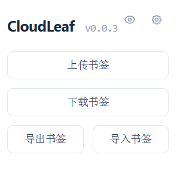
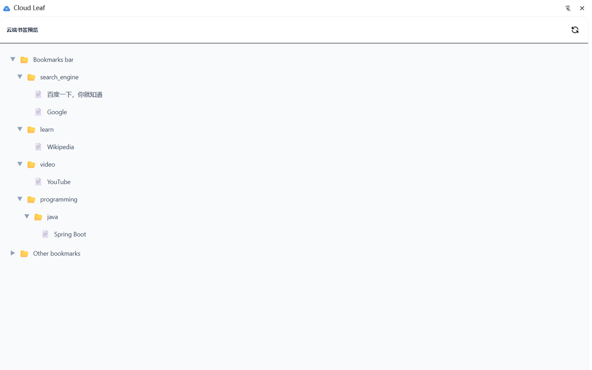

## 操作

打开 CloudLeaf 弹窗后，你会看到 [`上传书签`](#上传书签)、[`下载书签`](#下载书签)、[`导出书签`](#导出书签)、[`导入书签`](#导入书签) 四个主要操作按钮。

### 上传书签

将当前浏览器中的书签同步到云端。

1. 点击`上传书签`
2. CloudLeaf 会读取当前书签并与云端对比
3. 若无冲突，自动完成上传
4. 若**云端数据比本地新**，会弹出确认框，询问是否强制覆盖

:::caution
上传书签会**覆盖**云端的书签内容。
:::

### 下载书签

从云端恢复书签到当前浏览器。

1. 点击`下载书签`
2. CloudLeaf 会从你配置的同步源拉取书签数据
3. 若**本地数据比云端新**，会弹出确认框，询问是否强制覆盖
4. 下载成功后，当前浏览器的书签会被替换为云端内容

:::caution
下载书签会**替换**当前浏览器的全部书签。可以先在[预览模式](#预览模式)确认内容。
:::

### 导出书签

将当前书签保存为本地 JSON 文件（仅 Chrome 和 Edge 可用）。

1. 点击`导出书签`
2. 文件以 `CloudLeaf.json` 命名保存在浏览器默认下载位置

### 导入书签

从本地 JSON 文件恢复书签（仅 Chrome 和 Edge 可用）。

1. 点击`导入书签`
2. 选择之前导出的 JSON 文件
3. 若本地数据比文件中新，会弹出确认框

## 预览模式

随时可以查看云端存储的书签内容，无需执行上传或下载操作。

1. 点击右上角的眼睛图标
2. 侧边栏会展开，显示云端书签的文件夹树
3. 可以浏览文件夹结构，查看云端存储了哪些书签

:::tip
预览模式不仅可以用于同步前确认内容，你也可以随时打开侧边栏，直接使用云端书签。
:::

## 冲突检测

CloudLeaf 通过比较**本地书签时间戳**和**云端文件时间戳**来判断数据新旧：

- **本地较新**：下载时如果本地较新 → 提示是否强制下载
- **云端较新**：上传时如果云端较新 → 提示是否强制覆盖
- **已同步**：其他情况下，两端一致，直接执行
